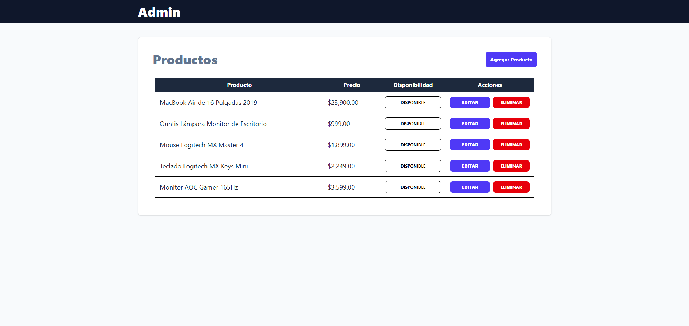
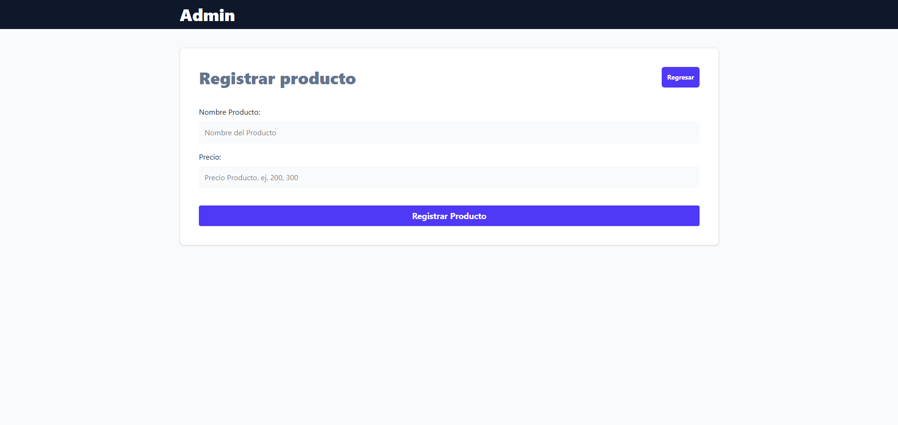
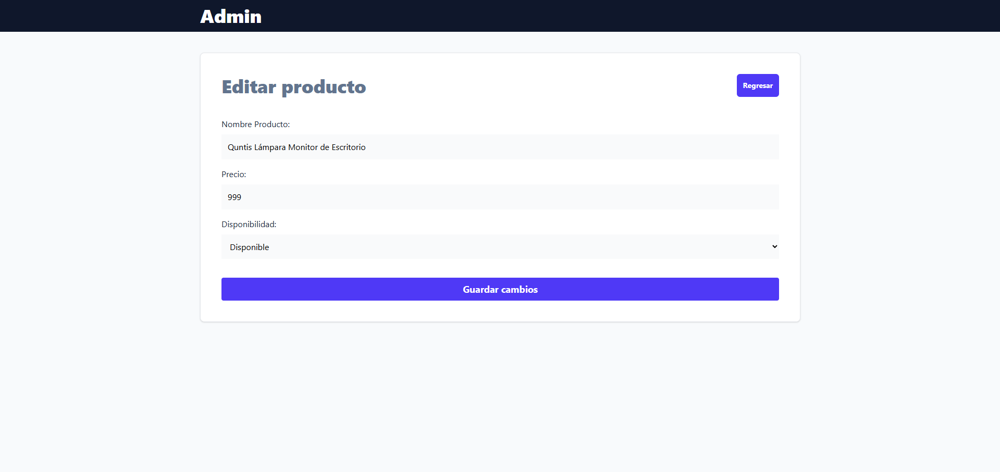

# Frontend para API REST de Productos

Este repositorio contiene el código fuente del frontend de la aplicación de gestión de productos, diseñada para interactuar con la API REST del proyecto.
el cual usamos un stack PERN (PostgreSQL, Express, React, Node.js), te permite crear nuevos productos, editar la información de algun producto o eliminar productos.

## Características

- Gestión de Rutas: Utiliza React Router DOM para la navegación y el enrutamiento de la aplicación.
- Patrón ROA (Route Over Action): Implementación avanzada de rutas para manejar acciones de formulario y carga de datos directamente en el router, lo que optimiza la experiencia del usuario.
- Diseño y Estilizado: Usa Tailwind CSS para un desarrollo rápido y un diseño moderno y responsivo (importado en index.css).
- CRUD Completo: Interfaz de usuario para todas las operaciones de gestión de productos:
  - Listado de Productos (/): Muestra la lista principal de productos utilizando productsLoader para cargar los datos inicialmente.
  - Creación de Productos (/productos/nuevo): Formulario manejado por newProductAction. 
  - Edición de Productos (/productos/:id/editar): Formulario que carga los datos específicos del producto (editProductLoader) y maneja la actualización (editProductAction).
  - Actualización de Disponibilidad (/): Permite cambiar el estado de disponibilidad del producto a través de updateAvailabilityAction.
  - Eliminación de Productos (/productos/:id/eliminar): Acción dedicada para eliminar registros (deleteProductAction).
- Estructura Modular: Las rutas y la lógica de la aplicación están organizadas en layouts, views (vistas) y components para facilitar el mantenimiento.
  
## Tech Stack

**Cliente:** 
- React.
- TypeScript.
- React Router DOM.
- Tailwind CSS.
- Vite.
  
## Autor

- [@Marcocruz01](https://github.com/Marcocruz01)

## Vista General

